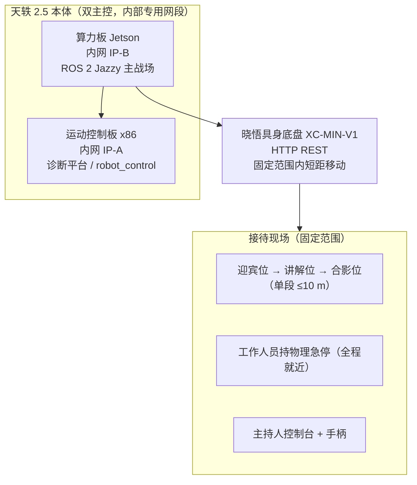
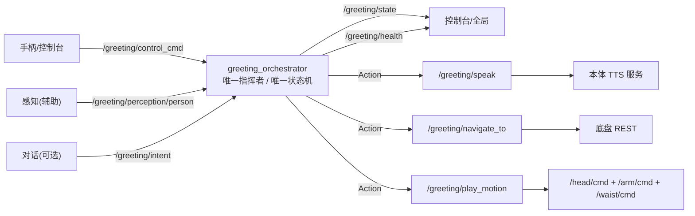

# 从零到「迎宾」：基于天轶 2.5 人形机器人的接待机器人开发实录

> 一个 ROS 2 Jazzy 的实机迎宾机器人项目，从需求评审、接口冻结，
> 到实机流式关节控制的完整开发记录。
>
> 工作空间：`greeting_ws`
>
> 本体：天轶 2.5（人形）＋晓悟 XC-MIN-V1（具身底盘）


> 系统：Ubuntu 24.04 + ROS 2 Jazzy + Python 3.12

***

## 摘要

我们做的是一台"会讲稿、会行礼、能被操作手随时接管"的接待迎宾机器人。
它在**固定接待区域**内，按一份由客户审核的讲稿，完成
**迎宾致意 → 主题讲解 → 送别**的仪式化流程，语音与动作按"**动作先行、语音跟随**"的时序并行编排。

这个项目真正难的地方，不是"让机器人动起来"，而是：

- 本体**没有 IK、没有笛卡尔接口、没有 MoveIt**，礼仪动作只能靠示教 + 关节关键帧；
- 实机的关节命令**不是一次性生效**，必须 ≥10 Hz 流式保持，位置/速度/电流分配策略直接决定"顿挫还是顺滑"；
- 领导在场的场合，**一次失控或一次讲错内容的代价，远高于"不够智能"**——所以"可控性"和"口径准确性"被排在了架构的第一优先级；
- 纸面推演 ≠ 实机可用，我们必须在**同一套接口契约**下，把编排层与各能力服务端解耦，便于逐项替换与复测。

下面按"背景 → 选型 → 架构 → 实现 → 难点 → 测试 → 成果 → 经验"展开，附关键代码与架构图。

***

## 一、项目背景

### 1.1 场景

项目面向场景**重要场合迎宾或政务/商务接待**，
机器人在会议中心的接待区域承担**领导/来宾迎接、主题讲解与引导**工作。


### 1.2 建设目标（KPI）

| #  | 目标      | 量化指标（建议值）                 | 优先级   |
| -- | ------- | ------------------------- | ----- |
| G1 | 接待流程完整性 | 按脚本完成率 ≥ 98%，重点场次**一次成功** | 中     |
| G2 | 讲解口径准确性 | 与客户文案一致率 **100%**（禁止自造内容） | **高** |
| G3 | 礼仪表现    | 致意动作到位率 ≥ 98%，无夸张/机械感     | 中     |
| G4 | 可控性     | 主持人一键暂停/接管响应 ≤ 200 ms     | **高** |
| G5 | 安全性     | 零碰撞、零夹伤；急停响应 ≤ 200 ms     | 高     |

**目标优先级：`G2 口径准确性`** **与** **`G4 可控性`** **>** **`G1 流程完整性`** **> 其他。**
翻译成工程语言就是：**内容必须照稿、主持人必须随时能停，而不是让机器人"自动跑完"。**

### 1.3 场景的三条定性判断（决定架构）

| #  | 判断                 | 架构后果                                        |
| -- | ------------------ | ------------------------------------------- |
| J1 | 接待是**计划性**的，不是随机客流 | 触发以**人工为主**（主持人/手柄），视觉自动感知**降为辅助**，且不直接驱动流程 |
| J2 | 接待是**仪式化、一次成功**的   | 必须脚本可预演、进度可视、支持**单步推进/回退/跳转**，不能依赖"自动重试"    |
| J3 | 机器人只在**固定范围**内活动   | 导航大幅简化，**原地动作优先**；移动必须由明确指令触发               |

> 关键洞察：整个流程必须**可被主持人随时接管**。领导接待中，主持人可能临时增减环节、跳过讲解、延长某段停留——所以状态机必须支持"单步推进/回退/跳转"，而不是自动一路跑完。

***

## 二、需求解析：从"讲稿"出发

接待的"标准答案"是一份**大会流程讲稿**，每个自然段都带一个动作提示，例如：

```text
【原地，抬手迎宾手势：机械手臂平缓向外轻轻张开，掌心朝外，柔和迎客姿态】
各位领导、各位来宾，各位企业家朋友们，大家好！欢迎莅临……【会议场地】。

【原地，右手机械臂平缓水平侧指，指向【主会场】方向，指引手势保持3秒，动作幅度柔和】
本次大会设置XXX核心活动板块……

【原地，双手机械臂微微躬身下压，轻缓行致意礼】
祝各位来宾此行收获满满，感谢您的到来！
```

我们把这份讲稿拆成 **7 个段（segment）**，每段是"**一个动作 + 一段台词**"的同步单元。
讲稿里"**【】**"包住的是动作提示，其余是台词。

**最关键的时序约定**来自礼仪需求：

- **开场打招呼（第 1 段）与离场祝贺（第 7 段）：动作比语音早 1.0 s**；
- **其余流程（第 2\~6 段）：动作比语音早 3.0 s**。

也就是说，机器人要"先抬手，再开口"——动作先行、语音跟随，两者在**同一步内并行**执行。

***

## 三、技术选型

| 维度     | 选型                                                            | 理由                                                                       |
| ------ | ------------------------------------------------------------- | ------------------------------------------------------------------------ |
| 操作系统   | Ubuntu 24.04（x86\_64 原生）                                      | 与本体算力板一致；**不 source 厂商 aarch64 打包栈**                                     |
| 中间件    | ROS 2 **Jazzy**                                               | 本体平台主线版本；生命周期/组合/QoS 完善                                           |
| 语言     | Python 3.12（编排/能力层）                                        | 编排要"现场改脚本不改代码"，Python 迭代最快                                            |
| 构建     | `colcon` + `--symlink-install`                                | YAML 改完**免重编译即时生效**（讲稿/动作表/手柄映射都靠它）                                      |
| 导航     | 自建任务状态机 + 底盘 REST                                          | 固定范围短距移位；REST 轮询 + 应用层围栏即可，无需引入完整建图/导航栈                              |
| 可视化    | RViz2 + `tf2_tools`                                           | TF 树连通性、关节可视化                                                            |
| 底盘     | 晓悟具身底盘，HTTP REST                                        | 厂商仅交付 REST（固件内 ROS2 接口未交付），REST 兜底足够                                     |
| 状态机    | 自研 Python 显式 FSM（**不用行为树**）                                   | 流程确定、可读性高、便于现场改脚本                                                        |

> **为什么不引入行为树？** 场景是"确定脚本 + 人工单步"，行为树带来的灵活性用不上，反而让"现场改一段台词"变成改代码。我们把"可变的部分"全部外置到 YAML。

***

## 四、系统架构设计

### 4.1 硬件拓扑



### 4.2 软件分层

```text
┌──────────────────────────────────────────────────────────────┐
│ L5 应用层  greeting_orchestrator  接待状态机（唯一指挥者）        │
│            · 讲稿驱动 · 单步/回退/跳转 · 动作-语音并行编排        │
├──────────────────────────────────────────────────────────────┤
│ L4 智能层  greeting_dialog  主题问答（受限于客户文案）+ 输出护栏   │
├──────────────────────────────────────────────────────────────┤
│ L3 能力层  greeting_body(礼仪动作)  greeting_voice(TTS)          │
│            greeting_nav(短距移位)   greeting_health(守护与自愈)   │
├──────────────────────────────────────────────────────────────┤
│ L2 接口层  ROS2 Topic/Service/Action（本体）｜HTTP REST（底盘）      │
├──────────────────────────────────────────────────────────────┤
│ L1 运行环境  ROS2 Jazzy · DDS · 网络/安全                        │
└──────────────────────────────────────────────────────────────┘
```

**三条架构原则：**

1. **主持人拥有最高权限**——控制指令优先级高于一切自动逻辑；
2. **全系统只有一套状态机**（`orchestrator`），本体与底盘均为被调用能力；
3. **原地动作优先**——能在迎宾位完成的不移动。

### 4.3 接口契约：先冻结，再开工

多人协作最容易翻车的地方是"接口各写各的"。所以我们先立了**接口契约冻结表**，
它是**唯一事实来源**：代码与表不一致时，以表为准。冻结对象包括
**接口名 + 字段（含顺序）+ QoS + 字段语义（单位/范围/枚举）**。

自建接口（载体包 `greeting_interfaces`，**5 msg / 1 srv / 3 action**）：

```
msg/     ConsoleCommand  GreetingEvent  PersonDetection  GreetingIntent  SubsystemHealth
srv/     GreetingControl
action/  Speak  NavigateTo  PlayMotion
```

**设计原则：凡是"长时执行 / 需要反馈 / 需要取消"的操作，一律用 Action，而不是 Service。**
因为主持人必须能**随时打断**播报、移位和动作。

话题拓扑（谁发布 / 谁订阅）：



> 🔴 **单一指挥者规则**：只有 `greeting_orchestrator` 调用三个 Action，模块之间禁止互相调用。

**QoS 规划**（跨主机 DDS 不匹配的典型表现是"话题存在但收不到数据"，所以订阅端一律**显式声明**）：

| 话题                            | 可靠性          | 深度          | 持久性                  | 理由           | <br />   | <br />          |
| ----------------------------- | ------------ | ----------- | -------------------- | ------------ | :------- | :-------------- |
| `/greeting/control_cmd`       | reliable     | 10          | volatile             | 主持人指令绝不可丢    | <br />   | <br />          |
| `/greeting/panel_command`     | reliable     | 10          | volatile             | 按键兜底         | <br />   | <br />          |
| `/greeting/state`             | reliable     | 1           | **transient\_local** | 控制台接入即拿到当前状态 | <br />   | <br />          |
| `/greeting/perception/person` | best\_effort | 5           | volatile             | 辅助感知，丢帧无妨    | <br />   | <br />          |
| `/head`                      | arm          | waist/cmd\` | reliable             | 1            | volatile | 50 Hz 连续下发，无需积压 |

### 4.4 工作空间包结构

```
greeting_ws/src/
├── greeting_interfaces/     # 接口契约（先冻结，其余包都依赖它）
├── greeting_orchestrator/   # 接待状态机（核心，Python 显式 FSM）
├── greeting_body/           # 实机礼仪动作服务端（流式关节帧）
├── greeting_voice/          # TTS 包装（Speak Action）
├── greeting_nav/            # 实机短距移位（底盘 REST）
└── greeting_teleop/         # 手柄(SBUS)按键网关
```

**关键设计：动作 / 语音 / 导航三类能力都实现同一套** **`/greeting/*`** **契约，编排层无需感知底层实现。**
这让我们能分项替换、分项复测，把"换一个服务端/改一段台词"的代价压到最低。

***

## 五、核心功能实现

### 5.1 编排层：讲稿驱动的状态机 + cue 并行时序

讲稿全部外置在 [greeting\_script.yaml](src/greeting_orchestrator/config/greeting_script.yaml)，
每段是若干 step，step 有四种 `kind`：

| kind     | 语义                                                         |
| -------- | ---------------------------------------------------------- |
| `cue`    | **一步内并行编排「动作 + 语音」**：先发动作，延迟 `lead_s` 再发语音，**两者都结束才推进下一步** |
| `speak`  | 只调 `/greeting/speak`                                       |
| `motion` | 只调 `/greeting/play_motion`                                 |
| `nav`    | 只调 `/greeting/navigate_to`                                 |

讲稿片段：

```yaml
version: "1.1"                       # 讲稿审核版本号，必须与节点参数一致

segments:
  - id: 1
    name: GREETING
    steps:
      - kind: cue
        motion_name: greet_open_arms
        speed_scale: 0.5
        lead_s: 1.0                  # 开场：动作比语音早 1.0 s
        text: "各位领导、各位来宾，各位企业家朋友们，大家好！……"
  - id: 3
    name: EXPLAIN
    steps:
      - kind: cue
        motion_name: point_side_right
        speed_scale: 0.7
        lead_s: 3.0                  # 其余流程：早 3.0 s
        text: "本次大会设置两大核心活动板块。……"
```

`cue` 的编排是这一层的灵魂。核心逻辑（[orchestrator\_node.py](src/greeting_orchestrator/greeting_orchestrator/orchestrator_node.py)）：

```python
def _start_cue(self, step) -> None:
    """一步内并行编排「动作 + 语音」：先触发动作，延迟 lead_s 再触发语音。
    两个 Action 并发执行，只有【两者都结束】才推进下一步。"""
    lead = max(0.0, float(step.get("lead_s", self._default_motion_lead_s)))

    goal = PlayMotion.Goal()
    goal.motion_name = str(step.get("motion_name", ""))
    goal.speed_scale = min(float(step.get("speed_scale", 0.5)), MOTION_SPEED_LIMIT)  # 礼仪硬约束 ≤0.7

    self._pending = {
        "kind": "cue",
        "motion": self._new_sub(self._motion.send_goal_async(goal)),  # 动作立即发
        "speak": None,
    }
    if lead <= 1e-6:
        self._send_cue_speak()
    else:
        self._cue_timer = self.create_timer(lead, self._send_cue_speak)  # 语音延迟 lead_s 发
```

**控制指令**用一条 `ConsoleCommand` 总线收口，支持：

| `cmd`              | 作用                             | 参数 `arg` |
| ------------------ | ------------------------------ | -------- |
| `start`            | 从第 1 段起，连播 7 段                 | —        |
| `pause` / `resume` | 暂停 / 恢复（cancel 当前 goal，记录现场）   | —        |
| `next` / `prev`    | 下一段 / 上一段（连播）                  | —        |
| `goto`             | **单段点播**指定段，播完回 `IDLE`，**不续播** | 段号，如 `2` |
| `stop` / `manual`  | 中止回 `IDLE` / 进入人工接管            | —        |

> 🔴 `goto`（单段点播）与 `start`（连播）的区别是刻意的：遥控器"一段一个按键"用 `goto`，
> 主持人"完整走一遍"用 `start`。

**版本校验守护内容安全**：`reload_script` 必须校验讲稿**审核版本号**，不符则拒绝加载——
防止"讲错内容"这种政治/商务场合的高代价失误。

```python
version = str(data.get("version", ""))
approved = str(self.get_parameter("approved_script_version").value)
if version != approved:
    return False, f"讲稿版本 {version!r} 与审核版本 {approved!r} 不符，拒绝加载"
```

### 5.2 实机动作库：从关键帧到流式关节帧

这是全项目技术含量最高的一块。本体只接受**关节空间**的流式命令，所以我们设计了
"**关键帧动作表 → 时间轴插值 → 逐帧下发**"的流水线。

动作表 [motions.yaml](src/greeting_body/config/motions.yaml) 里共 **11 个礼仪动作**，
数据结构是 `home`（中立待机姿态）+ `motions`（动作 → 关键帧）：

```yaml
home:
  waist_pitch_joint: 0.00
  shoulder_pitch_l_joint: 0.00
  # ... 全部 19 个关节 = 0.00（腿部不在表内）

motions:
  gentle_bow:                      # 轻缓致意礼（比 salute_bow 更浅更慢）
    duration: 4.4
    keyframes:
      - {t: 0.0, positions: {}}    # 起点 = /robot_state 实测角
      - t: 1.6                     # 轻缓躬下
        positions:
          waist_pitch_joint:       0.320   # 前倾 ≈18°
          head_pitch_joint:       -0.150   # 抬头补偿，视线仍朝来宾
          shoulder_pitch_l_joint: -0.180
          elbow_pitch_l_joint:    -0.500   # 肘微屈
      - {t: 3.0}                   # 不写 positions = 保持上一帧（停留一拍）
      - {t: 4.4, positions: {}}    # 缓缓起身回中立
```

**关键帧语义（务必记住）：**

- 写了 `positions` → 与 `home` **合并**（未写的关节取 `home`）；
- 不写 `positions` → **保持上一帧**（用于"停留一拍"）；
- `positions: {}` → 全部关节回 `home`；
- `t` 是**相对动作开始的绝对时间**，相邻 `t` 决定段时长；末帧 `t` 覆盖 `duration`。

执行侧（[motion\_server.py](src/greeting_body/greeting_body/motion_server.py)）把关键帧展开成时间轴，
用 **smoothstep 曲线**插值成 50 Hz 的姿态流：

```python
# 线性插值在关键帧反折处速度不连续（速度阶跃）→ 实机顿挫/抖动；
# 用 smoothstep a²(3-2a) 让每段起止速度都趋近 0，速度连续、无阶跃。
a = (t - t0) / span
a = a * a * (3.0 - 2.0 * a)
out[key] = v0 + a * (v1 - v0)
```

并且**解析地求导得到角速度**作为前馈，而不是用"相邻命令差分"——因为差分会被 50 Hz 循环里
`sleep` 的实际周期抖动（±10\~20%）放大，再经增益放大成功力矩纹波，表现为**持续高频啸叫**：

```python
# d/dt [p0 + a²(3-2a)(p1-p0)] = 6a(1-a)/span * (p1-p0)
k = 6.0 * a * (1.0 - a) / span
out[key] = k * (p1.get(key, p0[key]) - p0.get(key, p1[key]))
```

### 5.3 实机通道适配层：把所有安全约束集中到一处

[body\_adapter.py](src/greeting_body/greeting_body/body_adapter.py) 是"**不可绕过的最后一道闸**"，
把 `URDF 关节名 → 角度` 翻译成实机 `ros2_bridge_msgs` 控制帧，并集中承担全部安全约束。

实机控制帧的构造约定（与平台官方 `body_control` 对齐）：

```python
msg.mode = MODE_POSITION   # 位置模式（不传增益，刚度由驱动器内部决定）
msg.label = 0
msg.reserved = <模式移交约定值>   # 厂商 SDK 模式移交约定：首次下发后驱动器才接受位置命令
msg.header.frame_id = self._frame_ids.get(group, group)  # head / arm / waist
```

安全约束一览：

| 约束      | 默认值        | 作用                                     |
| ------- | ---------- | -------------------------------------- |
| 腿部电机禁用  | 硬编码        | `joint_map.yaml` 根本不含腿，腿部电机 51/52 永不下发 |
| 软限位收缩   | 0.05 rad   | 在 URDF `<limit>` 内缩，避免顶死硬限位            |
| 单帧位置增量  | ≤0.2 rad   | 避免阶跃跳变                                 |
| 臂跟随误差钳制 | ≤0.10 rad  | 期望位置限制在「实测 ± 该值」，防 Kp 顶死限位粘滑颤振         |
| 速度缩放上限  | ≤0.7       | 礼仪硬要求，编排层与服务端**各钳一次**                  |
| 前馈速度上限  | ≤3.0 rad/s | 对齐官方 `MAX_SPEED`                       |

**双臂必须整组下发**：左臂 7 个 + 右臂 7 个电机合并为**一条** `/arm/cmd`，
缺一个关节则本帧跳过该组——这是实机控制桥的硬要求。

### 5.4 实机启动链路：一键把整条链路拉起来

一条命令拉起实机动作服务端 + 手柄网关 + 两条命令桥 + 语音服务端 + 编排层：

```bash
source /opt/ros/jazzy/setup.bash && source install/setup.bash
ros2 launch greeting_teleop greeting_bringup.launch.py speed_limit:=0.5
```

[greeting\_bringup.launch.py](src/greeting_teleop/launch/greeting_bringup.launch.py) 依次 include：
`greeting_body/motion.launch.py` → `greeting_teleop/teleop.launch.py` →
`panel_command_bridge` / `flow_command_bridge` → `greeting_voice/speak_action_server` →
`greeting_orchestrator/orchestrator.launch.py`；需要移位时再单独拉起
`greeting_nav/navigate_to.launch.py`。

实机动作服务端 [motion\_server.py](src/greeting_body/greeting_body/motion_server.py)
把动作表展开成时间轴，按 50 Hz 逐帧流式下发到 `/arm/cmd`、`/head/cmd`、`/waist/cmd`；
**起点取 `/robot_state` 的实测健康关节角**，所以从任意当前姿态接入动作都不会跳变。

> 🔴 实机启动顺序有讲究：**先确认动作通道已有订阅者、电机 `error=0`，再让编排层开始下发**。
> 平台自检完成前 `/arm/cmd` 没有订阅者，此时的命令会被**硬预检拒绝**。

### 5.5 实机导航：REST + 自建任务状态机

底盘只提供 REST，且运动接口是 **fire-and-forget**：下发返回 `action_id` 后**必须自行轮询**。
[navigate\_to\_server.py](src/greeting_nav/greeting_nav/navigate_to_server.py) 因此自建了任务状态机：

```
Pre-flight（get_robot_health + 定位状态）
  → move_to（返回 action_id）
  → 轮询位姿（到点主判据：位置 ≤10 cm、角度 ≤2° + 静止确认）
  → 到达 / 超时 → 重试 1 次 → alg_relocalize → 交由编排层原地接待
```

并有**应用层坐标围栏**：点位超出固定范围即 `REJECT`。

```python
def _in_fence(self, x: float, y: float) -> bool:
    return (self._fence_x[0] <= x <= self._fence_x[1]
            and self._fence_y[0] <= y <= self._fence_y[1])
```

> 🔴 底盘 REST **无软件急停、无导航暂停/恢复、无** **`cmd_vel`** **流式速度**。
> 安全只依赖**物理急停 + 人员值守**；主持人"暂停"实现为 `cancel_action` + 记录现场 + 重新下发。
> `dry_run=true` 时机器人**不会移动**，只验证 Action 链路——现场实机接待前必须改回 `false`。

### 5.6 语音：把"没有 stop 接口"的 TTS 包装成可取消 Action

本体 TTS 服务 `/intelligent_interaction/tts/play` 只有 `query` / `append`，**没有 stop/打断接口**。
[speak\_action\_server.py](src/greeting_voice/greeting_voice/speak_action_server.py)
的做法是：`append` 排队播报，然后**轮询** **`query`** 直到播报结束（或按文本长度估算的兜底时长），
期间发布 `progress` / `speaking_text` 反馈。

```python
state = self._call("query", "")            # 先查态
appended = self._call("append", text)      # 再排队播报
# 轮询直到 playing→idle 稳定，或到按文本长度的兜底上限
```

> 我们**不假装支持做不到的能力**：`interrupt` 与 `resume_point` 字段在契约里存在，
> 但实机 TTS 无 stop/定位接口，节点会明确告警"按排队/从头处理"，而不是静默忽略。

### 5.7 手柄网关：按键也能开整场大会

实机上手柄经平台 SBUS 事件 `/sbus_data/event` 输入。[joy\_mapper.py](src/greeting_teleop/greeting_teleop/joy_mapper.py)
把**命名按键事件**翻译成迎宾命令，发布到 `/greeting/panel_command`，下游有两条链路：

```text
遥控器按键 → /sbus_data/event → (joy_mapper) → /greeting/panel_command
   ├→ (panel_command_bridge)  → /greeting/play_motion → 动作服务端        # 单个动作
   └→ (flow_command_bridge)   → /greeting/control_cmd → orchestrator 讲稿  # 整段大会流程
```

**组合键前提（Guard）是这里的精巧设计：先拨** **`E`** **三档开关选组，再按 A/B/C/D；
前提**默认不生效，上电后必须先拨动开关才激活（安全设计）。

***

## 六、关键技术难点与解决方案

这一节是全文最"硬"的部分——每一个坑都是实机踩出来的。

### 难点 1：本体没有 IK / 笛卡尔 / MoveIt，礼仪动作怎么做？

**问题**：穷举本体文档，`ik`、`逆解`、`笛卡尔`、`pose`、`moveit`、`轨迹` **零命中**。
只有关节空间流式话题。所以"给我一个朝向坐标 (x,y,z)"这条路根本不存在。

**方案**：走**示教路线**——

```
1. 示教    手动拖拽/遥控本体摆出目标姿态
2. 录制    ros2 bag 抓取关节 pos
3. 提帧    标记关键帧（起始/中间/终止），导出为 motions.yaml
4. 校验    每关节核对 URDF <limit>，留 ≥0.05 rad 余量
5. 礼仪审查 鞠躬角度/挥手幅度/转头速度符合政务礼仪
6. 插值    按 smoothstep 插值成 ≥10 Hz 序列
7. 预检    通道订阅者 ≥1 + 电机健康
8. 下发    流式发布到 /arm/cmd、/head/cmd、/waist/cmd
9. 收尾    停在安全姿位（收臂、抬头、直立），不悬停半空
```

> 一个真实的几何坑：肩 pitch 是**最近端**关节，臂一旦水平侧举（roll≈-1.48），
> pitch 就退化成绕臂自身纵轴的**扭转**——pitch 从 -1.20 扫到 +0.15，指向只从"偏右 86.5°"
> 变到"偏右 94.3°"。所以"指向主会场方向"必须靠 **腰 waist\_yaw + 头 head\_yaw** 转向会场，
> 而不是拧肩。这个结论来自正运动学校核，写进了动作表的注释里。

### 难点 2：命令不是一次性生效，必须"连续保持"

**问题**：规划方案 v1.0 用 `ros2 topic pub --times 20 -r 10`（约 2 秒 @10 Hz）验证命令，
以为"发完就不管了"。但实机命令**必须 ≥10 Hz 连续保持**，停止下发即失去目标。

**方案**：动作服务端以 **50 Hz（`publish_rate_hz`** **默认 50）** 流式下发，
并设 `warmup`（保持当前位姿约 1.5 s）软化 SDK 模式移交的瞬态。
50 Hz 而不是 10 Hz，是为了**降低滞后型抖动**。

### 难点 3：位置模式的 `spd` 语义——"期望速度"配错就顿挫

这是最隐蔽、调参最久的一个坑。

**问题**：位置模式下 `spd` 是"**期望速度**"，必须 **≥ 轨迹实际速度**，否则电机持续滞后追赶 → 抖动。
官方 `body_control` 的做法是按**各关节行程**分配速度（`spd_j = |Δq_j| / 运动时间`），
避免行程小的关节"先到再干等"（rush-and-wait 抖动）。

**我们踩过的错**：在运动段用"配置速度兜底"，结果段首尾瞬时速度趋零时，
`spd` 被顶到远高于真实轨迹速度的值（臂 0.7 / 腰 0.35 rad/s），电机冲到 20 ms 后的设定点后**干等**
→ 卡顿 + 满流保持嗡鸣。

**方案**：逐帧取 `spd = |轨迹瞬时速度| × FEEDFORWARD_SPEED_MARGIN`（margin=1.2，只略大于 1），
**只有轨迹完全静止**（`|ff| < STATIONARY_FF_EPS = 1e-9`）的保持段才回退到配置速度：

```python
if speed_override is not None:
    spd = float(speed_override)                      # warmup 柔和速度上限
elif abs(ff) < STATIONARY_FF_EPS:                    # 轨迹静止（保持段）
    spd = float(self._speeds[group]) * max(speed_scale, 0.0)
else:                                                # 运动段：跟随轨迹瞬时速度
    spd = abs(ff) * self._ff_margin
mc.spd = min(max(spd, self._min_ff_speed), MAX_FEEDFORWARD_SPEED)
```

> 🔴 `STATIONARY_FF_EPS` 必须取**极小值**。曾经取 0.02，结果把"缓慢爬行"误判成静止并回退到配置速度，
> 重新引入 rush-and-wait 卡顿。这个教训被写进了项目记忆。

### 难点 4：关键帧"保持"语义陷阱——双臂 0.2 s 内猛甩回 home

**问题**：动作表里"不写 `positions` = 保持上一帧"很直观，但**写了** **`positions`** **就与** **`home`** **合并**
（未列出的关节回 `home`，不是保持）。`farewell_bow` 里摆动帧只覆盖 `waist_yaw`，
如果不用 YAML 锚点带上鞠躬姿态，双臂会在 0.2 s 内从 `roll 0.95` 猛甩回 `home`
（瞬时 4.75 rad/s 超 3.0 上限被钳、并撞单帧 0.2 rad 限幅 = 硬顿挫）。

**方案**：用 YAML 锚点 `&farewell_pose`，摆动帧 `<<: *farewell_pose` **完整携带**鞠躬保持姿态的全部关节，
只覆盖摆动的那一个：

```yaml
- t: 2.2
  positions: &farewell_pose
    waist_pitch_joint: 0.50
    shoulder_roll_l_joint: 0.95
    shoulder_roll_r_joint: -0.95
    # ... 鞠躬保持姿态的全部关节
- {t: 3.2, positions: {<<: *farewell_pose, waist_yaw_joint:  0.25}}  # 腰左摆
```

### 难点 5：力位混合（mode=1）导致持续高频啸叫

**问题**：一开始想用 `mode=1` 力位混合 + 显式 Kp/Kd 做更精确的控制。
但增益值是从另一机型照抄来的，本机机型**电机与减速比不同**，
实测引起**持续高频啸叫**（电流环极限环 / 速度反馈噪声被 Kd 放大）。

**方案**：**回到** **`mode=0`** **位置模式，不下发 Kp/Kd**（对齐官方 `body_control`），
`kp=kd=tor=0`，刚度由驱动器内部决定。保留 `mode=1` 仅作回退实验路径，
并留了 `arm_kp_scale` / `arm_kd_scale` 作为排查旋钮。

### 难点 6：电机掉线的"假值 0.0"污染动作起点

**问题**：控制桥在跑、话题也有订阅者，电机仍可能**通讯掉线**（电机上报掉线故障码），
此时 `pos/cur` 恒为 **0.0 的假值**。如果把它当成实测起点，插值基线错误 → 动作**首帧大幅跳变**。

**方案**：动作开始前做**双重预检**——

1. **通道预检**（[body\_adapter.check\_channels](src/greeting_body/greeting_body/body_adapter.py)）：
   `ros2 topic info` 的订阅者数 ≥1，否则命令被**静默丢弃**（无任何报错）；
2. **电机健康门禁**（`motor_health`）：有反馈、`error=0`、`pos` 落在硬限位 ±0.2 rad 内。

起点则取**健康的实测角**，缺失/异常的关节回退 `home`：

```python
def start_pose(self, fallback):
    pose = dict(fallback)
    pose.update(self.healthy_measured())   # 只用「无故障且角度合理」的实测角
    return pose
```

> 🔴 **通道在线 ≠ 电机在线**。掉线时 `pos` 恒为 0.0 假值——这条被写进了契约和项目记忆。

### 难点 7：跨主机 QoS 不匹配 = "话题存在但收不到数据"

**问题**：本体是双主控（x86 + Jetson），跨主机 DDS 的 QoS 若不匹配，表现非常反直觉：
`ros2 topic list` 看得到话题，但就是收不到数据。

**方案**：契约里**冻结 QoS**，所有订阅端**显式声明**，禁止依赖默认值。
特别是 `/greeting/state` 用 `transient_local`，保证控制台**接入即拿到当前状态**（不用等下一次状态变化）。

***

## 七、测试与优化过程

### 7.1 测试分层

| 层级   | 内容                    | 工具                       |
| ---- | --------------------- | ------------------------ |
| 单元测试 | 插值、状态转移、脚本解析、护栏逻辑     | `colcon test` / pytest   |
| 集成测试 | 接待脚本全流程、暂停/续播/回退、降级路径 | `ros2 launch` + **干跑模式** |
| 现场测试 | 真实场地、真实讲稿、真实节奏        | 实机 + **完整演练 ≥3 次**       |
| 长稳测试 | 单次接待 + 多轮连续接待         | 日志 + 控制台追溯记录             |

### 7.2 实机全链路验证

编译自检：

```bash
export ROS_LOG_DIR=/tmp/ros_log ROS_HOME=/tmp/ros_home     # 避免 RSP 因权限被拒
source /opt/ros/jazzy/setup.bash
source /path/to/platform/setup.bash                       # 平台消息包（缺则部分包编译失败）
cd /path/to/greeting_ws
colcon build --symlink-install
source install/setup.bash
ros2 pkg list | grep greeting                             # 应列出全部 greeting_* 包
```

触发接待并观察状态机：

```bash
ros2 topic pub --once /greeting/control_cmd greeting_interfaces/msg/ConsoleCommand \
  "{cmd: 'start', arg: '', operator_id: 'cli'}"
ros2 topic echo /greeting/state
```

**预期效果**：

- 机器人逐段执行"**动作先行 + 语音跟随**"，同一步内动作与语音**并行**；
- 第 1、7 段动作比语音**早 1.0 s**；第 2\~6 段**早 3.0 s**；
- 一段内动作与语音都结束后才推进下一段，7 段走完回到 `IDLE`。

### 7.3 调试工具箱（优先用官方标准手段）

```bash
ros2 node list / ros2 action list | grep greeting   # 拓扑与在线服务端
ros2 topic echo /greeting/health                    # 三个布尔反映服务端在线情况
ros2 topic hz /joint_states                         # ≈50 Hz，21 个关节
ros2 run tf2_tools view_frames                      # 确认 TF 树连通
ros2 run tf2_ros tf2_echo odom base_footprint
ros2 topic info /arm/cmd                            # 实机动作前必看：Subscribers ≥1
ros2 interface show greeting_interfaces/action/PlayMotion
```

**常见问题速查：**

| 现象                 | 原因                                       | 处理                                  |
| ------------------ | ---------------------------------------- | ----------------------------------- |
| 状态停在 `IDLE`        | 未下发 `start` / 讲稿为空                       | 发 `/greeting/control_cmd`；看编排层加载日志  |
| 提示"动作服务端不在线"       | 动作服务端未起                                  | 确认 `motion.launch.py` 已启动、`/greeting/health` 为真 |
| `reload_script` 失败 | 讲稿 `version` ≠ `approved_script_version` | 对齐版本号                               |
| 运动中持续啸叫            | 用了 `arm_control_mode:=1`                 | 改回 `0`                              |
| 关节滞后追赶型抖动          | 位置模式速度上限过低                               | 提高 `publish_rate_hz`（如 50）或确认前馈速度生效 |
| 命令发出去没反应           | 通道无订阅者（静默丢弃）                             | `ros2 topic info` 查订阅者数             |

### 7.4 验收用例（节选）

| #   | 用例         | 预期结果                         |
| --- | ---------- | ---------------------------- |
| A1  | 主持人按"启动"   | 执行致意 + 欢迎语，姿态端庄，无夸张动作        |
| A2  | 讲稿逐段"下一段"  | 按顺序播报，段号与控制台一致，无跳段/串台        |
| A4  | 讲解中途"暂停"   | 播报与动作 ≤200 ms 内停止；"恢复"从记录点续播 |
| A6  | 底盘 REST 断网 | **原地完成接待**，控制台告警，流程不中断       |
| A8  | 按下急停       | 全停；无任何关节动作；控制台提示等待人工         |
| A9  | 讲稿版本号被篡改   | **拒绝启动接待**并告警                |
| A10 | 提问超范围      | 礼貌拒答并引导至工作人员，**不生成臆测内容**     |

### 7.5 优化迭代（按"痛点驱动"排序）

1. **顺滑度**：线性插值 → smoothstep 插值；差分速度 → 解析速度（消除高频啸叫）；
2. **速度分配**：固定基准速度 → 逐关节按行程/前馈分配（消除 rush-and-wait）；
3. **时序自然度**：调整关键帧 `t` 与 `speed_scale`，让"动作先行"的提前量在视觉上成立；
4. **动作丰富度**：从最初的 7 个动作扩充到 **11 个**（新增 `greet_open_arms` / `guide_pose` / `point_side_right` / `gentle_bow` 四个讲稿专用动作）；
5. **安全冗余**：编排层与服务端**双层钳制** `speed_scale ≤ 0.7`。

***

## 八、项目成果展示

### 8.1 交付物清单

- **6 个 ROS 2 包**，一套接口契约（5 msg / 1 srv / 3 action），一套讲稿（7 段）；
- **11 个礼仪动作**关键帧库，含首尾回中立、支持"保持一拍"；
- **实机启动链路**：一条 `ros2 launch` 命令拉起动作服务端 + 手柄网关 + 命令桥 + 语音服务端 + 编排层；
- **实机能力层**：动作服务端（50 Hz 流式关节帧 + warmup + 全量安全钳制）、导航服务端（REST + 轮询 + 围栏）、语音服务端（TTS 包装）；
- **操作侧**：手柄 SBUS 按键网关（组合键 + 分段点播）、缺省安全键（急停回 `IDLE`）；
- **文档体系**：项目规划方案、接口契约冻结表、多人协作开发规范、各包 README。

### 8.2 架构与链路图

（见 §4.1 硬件拓扑、§4.2 软件分层、§4.3 话题拓扑三张 Mermaid 图）

### 8.3 功能演示复现

由于本文档不附带真实截图/录屏（涉及实机与现场环境），下面给出**可复现的演示路径**，
便于读者自行运行并截取画面。建议的"截图位"已在每步标注。

**演示一：实机全链路 7 段流程**

```bash
# 终端 1：一键拉起实机链路
source /opt/ros/jazzy/setup.bash && source install/setup.bash
ros2 launch greeting_teleop greeting_bringup.launch.py speed_limit:=0.5

# 终端 2：触发接待
ros2 topic pub --once /greeting/control_cmd greeting_interfaces/msg/ConsoleCommand \
  "{cmd: 'start', arg: '', operator_id: 'cli'}"
ros2 topic echo /greeting/state
```

> 📸 **截图位**：① 实机上半身随讲稿逐段做出迎宾手势与致意礼（低速、有人守护）；
> ② 编排层日志"讲稿 7 段"与逐段 `[cue:...]` 完成日志；
> ③ `ros2 topic echo /greeting/state` 状态从 `GREETING` → … → `IDLE` 的推进。

**演示二：单段点播（复刻遥控器"一段一键"）**

```bash
ros2 topic pub --once /greeting/control_cmd greeting_interfaces/msg/ConsoleCommand \
  "{cmd: 'goto', arg: '3', operator_id: 'cli'}"   # 只播第 3 段，播完回 IDLE
```

**演示三：单发一个礼仪动作**

```bash
ros2 action send_goal /greeting/play_motion greeting_interfaces/action/PlayMotion \
  "{motion_name: 'gentle_bow', speed_scale: 0.6}" --feedback
```

> 📸 **截图位**：`/greeting/play_motion` 的 feedback `progress` 由 0→1，
> 以及实机上"双手机械臂微微躬身下压"的姿态。

**演示四：实机动作服务端（务必遵守安全前置）**

```bash
source /path/to/platform/setup.bash
ros2 topic info /arm/cmd          # 订阅者必须 ≥1
ros2 topic echo /robot_state --once   # error 全 0
# 低速、低电流、有人守护、急停可达
ros2 launch greeting_body motion.launch.py speed_limit:=0.5 arm_current:=3.0
ros2 topic hz /arm/cmd            # 播放期间接近 50 Hz
```

> 📸 **截图位**：启动日志"实机 PlayMotion 服务端就绪"、动作表 11 个动作、
> 臂增益缩放；以及播放期间 `/arm/cmd` 的 50 Hz 频率。

### 8.4 效果指标

| 指标     | 结果                                                         |
| ------ | ---------------------------------------------------------- |
| 讲稿段数   | 7 段，动作 / 语音并行编排                                            |
| 礼仪动作数  | 11 个（含首尾回中立）                                               |
| 动作下发频率 | 50 Hz（≥10 Hz 硬要求）                                          |
| 遥测反馈频率 | `/joint_states` ≈50 Hz，21 个关节                              |
| 时序提前量  | 首/末段 1.0 s；中间段 3.0 s                                       |
| 速度上限   | `speed_scale ≤ 0.7`（双层钳制）                                  |
| 安全约束   | 腿部禁用、软限位 0.05 rad、单帧 ≤0.2 rad、跟随误差 ≤0.10 rad、前馈 ≤3.0 rad/s |

***

## 九、开发经验总结

### 9.1 契约先行，是多人协作的"防翻车"基础设施

先冻结**接口契约**（名字 + 字段 + QoS + 语义），再并行开工，是本项目收益最高的一条纪律。
它让"三个 Owner（动作 A / 语音 B / 视觉与语言 C）"能同时写代码而不互相等待；
也让动作 / 语音 / 导航各能力服务端之间保持**接口等价**。

> 我们甚至用一张"变更记录表"管理契约演进（v1.0 → v1.1 → v1.2），
> 比如 v1.2 明确**移除**了不再需要的动作名 `dance`。**契约是唯一事实来源。**

### 9.2 把"可变的东西"全部外置到配置

讲稿、动作、点位、手柄映射全部是 YAML，配合 `--symlink-install`，**改 YAML 免重编译即时生效**。
现场"临时加一句台词""微调一个点位"这种需求，不需要重新构建——这对一次成功的仪式化接待至关重要。

### 9.3 安全约束要"集中且不可绕过"

把所有限幅、预检、健康门禁**收敛到唯一一个适配层**（`body_adapter`），
上层编排无论怎么写都不会越过安全线。腿部电机干脆**从映射表里删掉**——
"不存在"比"记得别用"更可靠。

### 9.4 实机的坑，文档里往往不会写

这个项目超过一半的调试时间花在了**文档没写的实机行为**上：

- 命令不是一次性生效，必须连续保持；
- 话题无订阅者时命令**被静默丢弃、无任何报错**；
- 电机掉线时 `pos` 恒为 0.0 的**假值**；
- 位置模式的 `spd` 语义配错就顿挫；
- 力位混合增益跨机型照抄就啸叫。

**结论**：纸面推演通过**不代表**实机可用。必须预留实机复测与礼仪调参的时间，
并坚持"低速、低电流、空载、有人守护、急停可达"的首次调试纪律。

### 9.5 可靠性设计：不追求"更聪明"，而追求"不静默失败"

领导接待场景的目标优先级是"**口径准确 + 可控**"高于"智能"。
所以我们的降级矩阵是"**能退就退、不能退就喊**"：底盘不可达 → 全程原地接待；
动作通道未就绪 → 纯语音讲解（手势降级）；异常一律**告警 + 兜底话术**，绝不"静默无响应"。

### 9.6 下一步

- 补齐 `greeting_console` 主持人控制台（本期必备，含单步/暂停/接管/追溯）；
- 视客户需求接入 `greeting_dialog`（受限于客户文案的主题问答 + 输出护栏）；
- 实机复现并量化 `robot_control` 静默退出的复现率，完善 `greeting_health` 守护与自愈；
- 现场建图、点位标定、礼仪调参，完成 ≥3 次完整演练。

***

## 附录：快速上手

```bash
# 1. 环境
export ROS_LOG_DIR=/tmp/ros_log ROS_HOME=/tmp/ros_home
source /opt/ros/jazzy/setup.bash
source /path/to/platform/setup.bash       # 平台消息包
cd /path/to/greeting_ws

# 2. 编译（首次全量；之后改单包）
colcon build --symlink-install
source install/setup.bash

# 3. 启动实机链路（一条命令）
ros2 launch greeting_teleop greeting_bringup.launch.py speed_limit:=0.5
#   触发接待（另开终端）
ros2 topic pub --once /greeting/control_cmd greeting_interfaces/msg/ConsoleCommand \
  "{cmd: 'start', arg: '', operator_id: 'cli'}"
```

**相关文档**：

| 文档            | 内容                               |
| ------------- | -------------------------------- |
| 大会流程.md       | 讲稿原文（动作提示 + 台词）                  |
| 接口契约冻结表.md    | 话题 / 服务 / Action 接口与安全约定（唯一事实来源） |
| 酒店迎宾项目规划方案.md | 场景、架构、难点、风险、验收                   |
| 多人协作开发规范.md   | 分工与协作约定                          |

***

> ⚠️ **安全声明**：本文所述方案**不能替代实机测试**，最终效果必须在真实环境中验证。
> 涉及实机操作时，请务必确认：急停可用、限位设置、电压电流安全、操作权限、测试环境隔离；
> 上电前请确认 `/arm/cmd` 等通道已有订阅者、`/robot_state` 电机 `error=0`，
> 并确保**急停完全弹出、工作人员持急停就位**。
>
> 🔴 本文中的 `robot_control` 静默退出、底盘无软件急停等问题均为实机已知风险，
> 请以最新厂商文档与现场实测为准。

